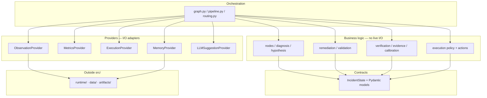
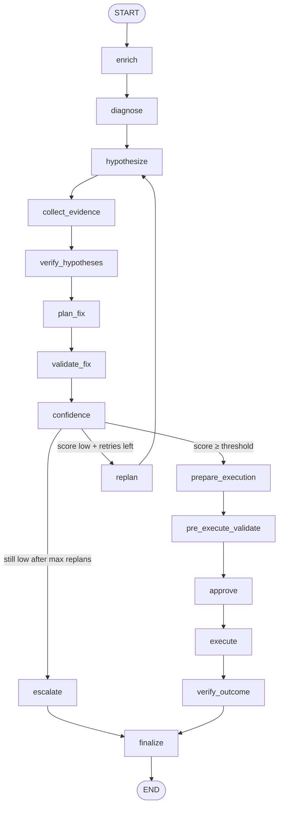

# Autonomous Incident-Response Agent

**A safety-first agent that diagnoses Kubernetes incidents, plans remediations, and only mutates the cluster when calibrated confidence clears an explicit policy gate.**

[](https://www.python.org/downloads/)
[](#license)
[](CONTRIBUTING.md)

---

## Understand this project in 2 minutes

| | |
|---|---|
| **Problem** | SRE teams drown in CrashLoopBackOff and similar alerts. Manual triage is slow; naive automation is unsafe. |
| **What this is** | A LangGraph-orchestrated agent with a **deterministic reasoning core**, **provider adapters** (synthetic / K8s / Prometheus), **confidence calibration**, and an **allowlisted execution policy**. |
| **Stage today** | **Stage 0 close** — deterministic CrashLoop eval is frozen; advisory LLM is measured against that freeze. Not a production on-call bot. |
| **Design bet** | Prove contracts, metrics, and safety gates **before** the model can suggest anything. The LLM may advise; it may not route, approve, or mutate. |
| **How you help** | Add scenarios, review SRE workflows, simulate K8s failures, improve eval metrics, harden remediation safety. → [CONTRIBUTING.md](CONTRIBUTING.md) |

```text
Alert / observations
        │
        ▼
 Diagnose → Hypothesize → Collect evidence → Verify
        │
        ▼
 Plan fix → Validate → Score confidence
        │
   ┌────┴────┐
   │ replan  │  (low confidence, retries left)
   └────┬────┘
        │
   still low after max replans → NOOP / escalate (no mutation)
        ▼
 Prepare → Pre-validate → Approve → Execute → Verify outcome → Done
                              ▲
                    ExecutionPolicy × calibrated confidence
```

---

## Why this exists

Most “AI ops” demos jump straight to an LLM calling `kubectl`. This project inverts that:

1. **Contracts first** — typed `IncidentState` for the full lifecycle  
2. **Eval first** — synthetic incidents with ground truth and multi-dimensional scorecards  
3. **Safety first** — risk × confidence gates; allowlisted actions only; dry-run by default  
4. **Providers, not hard-wiring** — swap Synthetic → Kubernetes / Prometheus without rewriting diagnose/plan nodes  

If you care about **trustworthy automation for SRE**, this is the foundation we want the community to pressure-test.

---

## Current status (Stage 0)

| Area | Status | Notes |
|------|--------|--------|
| CrashLoopBackOff synthetic dataset | **Done** | Generator + schema + fixtures; JSONL eval |
| Deterministic diagnose / hypothesize / plan / validate | **Done** | Pure business nodes; no LLM required |
| Evidence collection + Bayesian hypothesis verification | **Done** | Live stack = specs + Bayes-factor belief update; separate OOM metric loop is library-only |
| Confidence scoring + replan routing | **Done** | Threshold + `max_replans` |
| Confidence calibration (mutation gate) | **Done** | Blends posterior × evidence × memory |
| Local episode memory | **Done** | Priors / retrieval; runtime under `runtime/` |
| Execution lifecycle (prepare → approve → execute → verify) | **Done** | Dry-run default |
| Kubectl allowlisted actions | **Done (opt-in)** | `restart_pod`, `rollback_deployment`, `rollout_restart`, `scale_deployment`, `update_resource_limit` |
| Live K8s observations | **Done (opt-in)** | `KubernetesObservationProvider` |
| Live Prometheus metrics | **Done (opt-in)** | `PrometheusMetricsProvider` |
| Multi-dimensional eval scorecard | **Done** | Diagnosis · efficiency · calibration · remediation safety · MTTR |
| Deterministic 9-case baseline | **Frozen** | [docs/baselines/2026-09-07.md](docs/baselines/2026-09-07.md) — diagnosis 9/9, top hyp 7/9, fix 5/9 |
| Advisory LLM boundary | **Done (opt-in)** | Suggest hypotheses/evidence only; ingestion rejects control-plane output. CI stays no-op. |
| LLM vs baseline compare | **Done** | Qwen and Gemma: diagnosis stayed 9/9; fix 5/9 → 2/9; unsafe accepted 0. See [baselines](docs/baselines/README.md). |
| Additional incident classes (OOM, ImagePull, network) | **Open** | CrashLoop is first; community scenarios welcome |
| Production on-call deployment | **Not yet** | Stage 0 is research + eval scaffolding |

Details: [docs/STATUS.md](docs/STATUS.md).

---

## Architecture

Layers depend **inward**. Outer layers may call inner layers; domain rules never reach out for HTTP, kubectl, or LLMs directly.

Hypothesis values are **belief** after evidence updates; remediation scores are **heuristic suitability**, not `P(success)`. Details: [docs/SCORE_SEMANTICS.md](docs/SCORE_SEMANTICS.md).



| Layer | Location today | Responsibility |
|-------|----------------|----------------|
| Contracts | `src/incident_agent/contracts/` | Typed state only |
| Business | `nodes/`, `diagnosis/`, `hypothesis/`, `remediation/`, `validation/`, `verification/`, `calibration/`, `execution/` | Domain decisions |
| Orchestration | `graph.py`, `pipeline.py`, `routing.py` | Sequencing and replan |
| Providers | `src/incident_agent/providers/` | Observation / Metrics / Execution / Memory / LLM backends |
| LLM | `src/incident_agent/llm/` | Advisory suggestions only; ingestion gate before business use |
| Datasets & eval | `datasets/`, `eval/`, `benchmark.py` | Synthetic data, baseline freeze, LLM compare |
| Runtime data | `runtime/`, `data/`, `artifacts/` | Never under `src/` |

Full rules: [docs/ARCHITECTURE.md](docs/ARCHITECTURE.md) · [docs/CODING_PRINCIPLES.md](docs/CODING_PRINCIPLES.md).

---

## Workflow

What happens on one incident run:



**Safety path:** `ExecutionPolicy` compares **calibrated confidence** to per-risk thresholds (LOW 0.75 → CRITICAL 0.99). Below threshold → human approval / no mutation. Stage-0 default execution is **dry-run**.

---

## Quickstart

Requires **Python 3.12+**.

### Setup

```bash
git clone https://github.com/AryaNamekart/autonomous-incident-response-agent.git
cd autonomous-incident-response-agent

python -m venv .venv
# Windows PowerShell: .\.venv\Scripts\Activate.ps1
# macOS/Linux:
source .venv/bin/activate

pip install -U pip
pip install -e ".[dev,agent]"
```

### Generate synthetic CrashLoop incidents

```bash
python -m incident_agent.datasets.crashloopbackoff.generate \
  --out "./data/synthetic/crashloopbackoff/incidents.jsonl" \
  --n 50
```

### Run tests

```bash
pytest
ruff check src tests
```

### Benchmark (plumbing baselines)

```bash
export PYTHONPATH=./src   # Windows PowerShell: $env:PYTHONPATH=(Resolve-Path .\src).Path

python -m incident_agent.benchmark \
  --task crashloopbackoff \
  --dataset "./data/synthetic/crashloopbackoff/incidents.jsonl" \
  --baseline heuristic \
  --out-dir "./artifacts/benchmarks/crashloop"
```

Baselines: `oracle` (sanity / 1.0 category accuracy) · `empty` (lower bound) · `heuristic` (keyword matcher).

### Freeze today's deterministic baseline

```bash
export PYTHONPATH=./src   # Windows PowerShell: $env:PYTHONPATH=(Resolve-Path .\src).Path
python -m incident_agent.eval.freeze_baseline --label 2026-09-07
```

This writes run artifacts under `artifacts/baselines/<label>/` plus a
commit-friendly snapshot under `docs/baselines/<label>.json` and
`docs/baselines/<label>.md`. Frozen Stage-0 numbers:
diagnosis **9/9**, top hypothesis **7/9**, fix **5/9**.

### Optional: advisory LLM compare

Stage-0 defaults stay deterministic (`NoopLLMSuggestionProvider`). With
`OPENROUTER_API_KEY` in `.env`, compare the same 9 incidents against the
freeze. Catalog IDs change; pin the model for the run, do not treat “free”
as stable.

```bash
python -m incident_agent.eval.compare_llm --baseline docs/baselines/2026-09-07.json --label YYYY-MM-DD-qwen
python -m incident_agent.eval.compare_llm --model google/gemma-3-27b-it --label YYYY-MM-DD-gemma
```

```python
from incident_agent.llm import OpenAILLMSuggestionProvider
from incident_agent.providers import default_providers

bundle = default_providers(llm=OpenAILLMSuggestionProvider.from_env())
```

The LLM may only suggest hypotheses or evidence. Routing and execution stay
deterministic. On API failure the provider returns no suggestions.
Boundary and measured results: [docs/LLM_BOUNDARY.md](docs/LLM_BOUNDARY.md).

### Optional: live Kubernetes observations

```bash
pip install -e ".[k8s]"
```

```python
from incident_agent.providers import k8s_observation_providers
from incident_agent.graph import GRAPH

bundle = k8s_observation_providers()  # kubeconfig / in-cluster
out = GRAPH.invoke(state, providers=bundle)
```

Reasoning nodes stay unchanged — only the observation source swaps.

More detail: [docs/](docs/README.md).

---

## How to contribute

We want collaborators who care about **SRE realism** and **safe automation**, not just code volume.

| Path | Impact | Start here |
|------|--------|------------|
| **1. Add incident scenarios** | Better coverage & harder eval | [CONTRIBUTING.md §1](CONTRIBUTING.md#1-add-incident-scenarios) |
| **2. Review SRE workflows** | Keep the agent honest vs real on-call practice | [CONTRIBUTING.md §2](CONTRIBUTING.md#2-review-sre-workflows) |
| **3. Add Kubernetes failure simulations** | Richer telemetry & failure modes | [CONTRIBUTING.md §3](CONTRIBUTING.md#3-add-kubernetes-failure-simulations) |
| **4. Improve evaluation metrics** | Measure what matters for autonomy | [CONTRIBUTING.md §4](CONTRIBUTING.md#4-improve-evaluation-metrics) |
| **5. Review remediation safety policies** | Prevent dangerous mutations | [CONTRIBUTING.md §5](CONTRIBUTING.md#5-review-remediation-safety-policies) |

Read **[CONTRIBUTING.md](CONTRIBUTING.md)** before opening a PR. Architecture PRs that mix layers (e.g. kubectl inside `diagnose`) will be asked to change.

---

## Documentation map

| Doc | Purpose |
|-----|---------|
| [CONTRIBUTING.md](CONTRIBUTING.md) | Setup, contribution paths, PR checklist |
| [docs/ARCHITECTURE.md](docs/ARCHITECTURE.md) | Layers, providers, workflow depth |
| [docs/STATUS.md](docs/STATUS.md) | What’s shipped vs planned |
| [docs/LLM_BOUNDARY.md](docs/LLM_BOUNDARY.md) | Suggest-not-control rule + measured LLM compares |
| [docs/baselines/README.md](docs/baselines/README.md) | Frozen baseline and Qwen/Gemma scorecards |
| [docs/CODING_PRINCIPLES.md](docs/CODING_PRINCIPLES.md) | Naming, size limits, SoC rules |
| [docs/README.md](docs/README.md) | Full docs index |
| [runtime/README.md](runtime/README.md) | Where runtime data lives |
| [datasets/crashloopbackoff/README.md](src/incident_agent/datasets/crashloopbackoff/README.md) | Scenario schema & generator |

When docs disagree with code, **trust the code** and open a docs PR.

---

## License

A license file is not yet committed. If you are evaluating this for your org, treat it as **source-available for collaboration** until an SPDX license is added. Maintainers: add `LICENSE` before a wide public launch so contributors know the terms.

---

## Maintainers & contact

- Repository: [AryaNamekart/autonomous-incident-response-agent](https://github.com/AryaNamekart/autonomous-incident-response-agent)
- Prefer **GitHub Issues** for bugs, scenario ideas, and safety review threads  
- Prefer **Pull Requests** for concrete improvements (even small fixture PRs are welcome)
