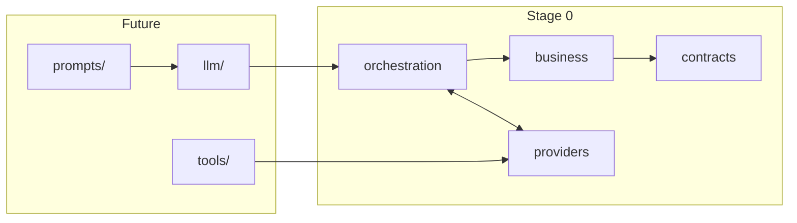
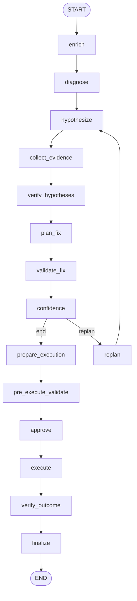

# Architecture

This document explains **how the agent is structured** and **how one incident flows** through it. For coding rules, see [CODING_PRINCIPLES.md](CODING_PRINCIPLES.md). For shipped vs planned work, see [STATUS.md](STATUS.md).

---

## Design goals

1. **Deterministic core** — Stage-0 reasoning paths run without LLMs, API keys, or a cluster  
2. **Provider isolation** — Observation / Metrics / Execution / Memory swap without rewriting business nodes  
3. **Safety before autonomy** — calibrated confidence × risk policy gates every mutation  
4. **Eval-native** — synthetic incidents + decision traces + multi-dimensional scorecards  

---

## Layered system



Depend **inward**. Domain heuristics must not import live clients.

| Layer | Today | Must not contain |
|-------|-------|------------------|
| Contracts | `contracts/` | I/O, prompts, scoring formulas used as side effects |
| Business | `nodes/`, `diagnosis/`, `hypothesis/`, `remediation/`, `validation/`, `verification/`, `evidence/`, `calibration/`, `execution/` (policy/actions) | LangGraph wiring, HTTP, LLM APIs |
| Orchestration | `graph.py`, `pipeline.py`, `routing.py` | Root-cause regexes, prompt templates |
| Providers | `providers/` | Hypothesis catalogs, confidence formulas |
| Datasets / eval | `datasets/`, `eval/`, `benchmark.py` | Live cluster mutation |
| Runtime | `runtime/`, `data/`, `artifacts/` | Product source |

Folder names may migrate toward `business/` and `orchestration/` packages; **boundaries matter more than the rename**.

---

## Provider model

Nodes and the graph depend on **protocols**, not concrete backends.

| Protocol | Stage-0 default | Opt-in live |
|----------|-----------------|-------------|
| `ObservationProvider` | Synthetic | `KubernetesObservationProvider` |
| `MetricsProvider` | Synthetic / stub | `PrometheusMetricsProvider` |
| `ExecutionProvider` | Dry-run | `KubectlExecutionProvider` (allowlisted) |
| `MemoryProvider` | No-op / local episode store | Extensible (e.g. vector store later) |

Inject via `ProviderBundle` on `GRAPH.invoke(...)`. Business nodes read `Observations` and write partial state updates — they do not know whether logs came from JSONL or the API server.

---

## Incident workflow

Compiled graph (`build_graph()` in `graph.py`):



### Phase intent

| Phase | Intent |
|-------|--------|
| `enrich` | Attach provider-backed context to state |
| `diagnose` | Symptom / category framing from observations |
| `hypothesize` | Ranked root-cause candidates |
| `collect_evidence` | Planned telemetry pulls |
| `verify_hypotheses` | Bayesian / spec-driven confirmation |
| `plan_fix` | Remediation plan from confirmed hypothesis |
| `validate_fix` | Structural / policy checks on the plan |
| `confidence` | Score (+ calibration signals) |
| `replan` | Increment counter; loop to hypothesize |
| `prepare_execution` … `execute` | Gate + allowlisted mutation (often dry-run) |
| `verify_outcome` | Did the world improve? |
| `finalize` | Terminal state + memory episode |

### Confidence routing

From `routing.py` (defaults):

- Score ≥ threshold (default **0.7**) → enter execution lifecycle  
- Score low and `replan_count < max_replans` → replan  
- Retries exhausted → still enter execution lifecycle; prepare/approve may **skip** unsafe actions  

### Execution safety

`ExecutionPolicy` maps action `RiskLevel` → minimum **calibrated** confidence:

| Risk | Default minimum calibrated confidence |
|------|----------------------------------------|
| LOW | 0.75 |
| MEDIUM | 0.85 |
| HIGH | 0.95 |
| CRITICAL | 0.99 |

Allowlisted kubectl actions today: `restart_pod`, `rollout_restart`, `scale_deployment`, `update_resource_limit`. No free-form shell.

---

## Dual orchestration paths

| Path | Entry | Use |
|------|-------|-----|
| LangGraph | `GRAPH.invoke(state, providers=...)` | Branching, future checkpoints |
| Deterministic pipeline | `run_deterministic_lifecycle(...)` | Fast tests / debugging |

Parity tests should keep them aligned where both exist.

---

## Data & runtime layout

```text
src/incident_agent/     # product source only
runtime/                # logs, memory, state, ad-hoc artifacts (gitignored)
data/synthetic/         # generated JSONL datasets
artifacts/              # benchmark reports
```

Never write agent dumps under `src/`. See [runtime/README.md](../runtime/README.md).

---

## Evaluation architecture

`incident_agent.eval` scores **decision traces**, not just final labels:

1. Diagnosis accuracy  
2. Investigation efficiency  
3. Confidence calibration  
4. Remediation safety  
5. Recovery time (MTTR proxy)  

Dataset-layer eval (`datasets/eval.py`) remains available for prediction JSONL vs ground truth. Prefer extending pure functions in `eval/` when improving autonomy metrics.

---

## Extending the system (checklist)

1. Identify the layer  
2. Keep Stage-0 paths testable without network  
3. Add fakes for any new provider  
4. Update tests + [STATUS.md](STATUS.md) / README if user-visible behavior changes  
5. Delete dead code you replace  

Questions for maintainers: open a GitHub Issue with label-style title (`safety:`, `eval:`, `scenario:`).
